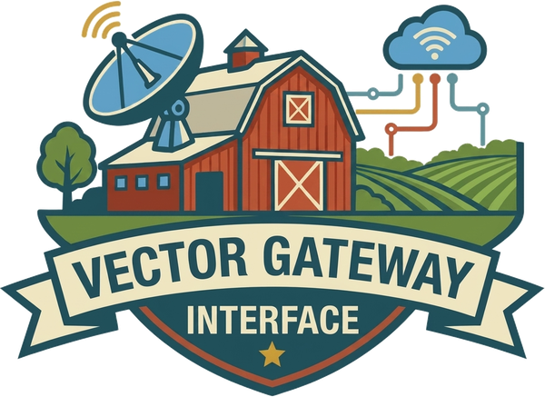

<div class="hero" markdown>

<div class="hero-logo" markdown>
{ .hero-logo-img }
</div>

# vgi-rpc C++

C++ implementation of the [vgi_rpc](https://vgi-rpc.query.farm/) framework — Apache Arrow IPC-based RPC for high-performance data services.

<p class="built-by">Built by <a href="https://query.farm">Query.Farm</a></p>

</div>

Define RPC methods with typed C++20 handlers using Arrow schemas. The framework provides server dispatch with automatic parameter extraction and result serialization over stdin/stdout pipe transport.

## Key Features

- **Unary RPCs** with typed parameter extraction via `get<T>(name)`
- **Producer streams** for server-initiated batch data flows
- **Exchange streams** for bidirectional batch processing
- **Client-directed logging** at configurable levels
- **Introspection** via optional `__describe__` method
- **Error handling** — exceptions automatically converted to protocol error responses
- **Builder pattern** — fluent `ServerBuilder` API for registering methods

## Three Method Types

### Unary

A single request produces a single response. The client sends parameters, the server returns a result.

```
Client  ──  add(a=2, b=3)  ──▸  Server
Client  ◂──     5.0         ──  Server
```

### Producer

The server pushes batches to the client until calling `out.finish()`:

```
Client  ──  produce_n(count=3)  ──▸  Server
Client  ◂──  {index: [0]}       ──  Server
Client  ◂──  {index: [1]}       ──  Server
Client  ◂──  {index: [2]}       ──  Server
Client  ◂──    [finish]         ──  Server
```

### Exchange

Lockstep bidirectional streaming — one request, one response, repeat:

```
Client  ──  exchange_scale(factor=2.5)  ──▸  Server
Client  ──    {value: [10.0]}           ──▸  Server
Client  ◂──   {value: [25.0]}          ──  Server
Client  ──    {value: [4.0]}            ──▸  Server
Client  ◂──   {value: [10.0]}          ──  Server
Client  ──      [close]                 ──▸  Server
```

## Quick Example

```cpp title="examples/quick_example.cpp"
--8<-- "examples/quick_example.cpp"
```

## Next Steps

- Read the [Getting Started](getting-started.md) guide for build instructions and setup
- Browse the [Examples](examples/index.md) for hello world, calculator, and streaming
- Check out the [API Reference](api/index.md) for all classes and functions
- Learn about the [wire protocol](https://vgi-rpc.query.farm/wire-protocol) and [benchmarks](https://vgi-rpc.query.farm/benchmarks) on the main vgi-rpc site
- See all [language implementations](https://vgi-rpc.query.farm/#languages) — Python, Go, TypeScript, C++

---

<p style="text-align: center; opacity: 0.7;">
  <a href="https://vgi-rpc.query.farm">vgi-rpc</a> &middot; <a href="https://query.farm">Query.Farm</a>
</p>
